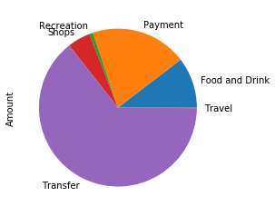
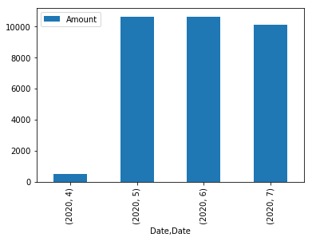

# Budget Analysis

## Spending Categories Chart

## Spending Bar Chart

## Transaction Data

### Expenses by Category

* Food and Drink - $3317.19
* Payment - $6310.50
* Recreation - $235.50
* Shops - $1500
* Transfer - $20537.34
* Travel - $35.19

## Income Data

* Last year's Income - $6000
* Current Monthly Income - $500
* Projected Yearly Income - $6085