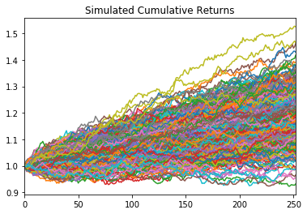
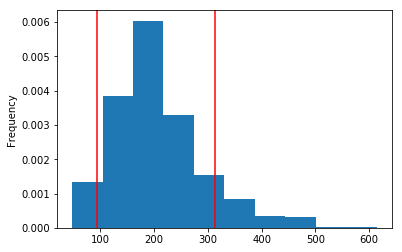

# Retirement Planning (1-year with 500 simulations because of computer crashes)

## Simulated Cumulative Returns

## Histogram of 90% Confidence Interval

## Expected Returns at 1 years (1-year because of computer crashes)

* 90th percentile - 30.8%
* 50th percentile - 19.51%
* 10th percentile - 8.32%

## Expected Returns at 1 years with $20,000 Initial Investment (1-year because of computer crashes)

* 90th percentile - $26160.46
* 50th percentile - $23902.29
* 10th percentile - $21663.34

## Retirement Analysis

* A yearly amount of $6085 is required to satisfy the income needs, the 4% withdrawal rate of $866.53 is not enough

* With a 50% increase in the initial investment, the 4% withdrawal rate of $1299.8 is enough to cover the yearly income of $6085