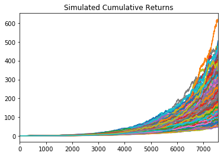

# Retirement Planning (1-year with 500 simulations because of computer crashes)

## Simulated Cumulative Returns

## Histogram of 90% Confidence Interval

## Expected Returns at 1 years (1-year because of computer crashes)

* 90th percentile - 31283.27%
* 50th percentile - 18852.6%
* 10th percentile - 11617.88%

## Expected Returns at 1 years with $20,000 Initial Investment (1-year because of computer crashes)

* 90th percentile - $6276654.35
* 50th percentile - $3790519.95
* 10th percentile - $2343576.02

## Retirement Analysis

* A yearly amount of $6085 is required to satisfy the income needs, the 4% withdrawal rate of $93743.0408 is enough

* With a 50% increase in the initial investment, the 4% withdrawal rate of $140614.56 is enough to cover the yearly income of $6085

* Portfolio Performance Overtime
	* 